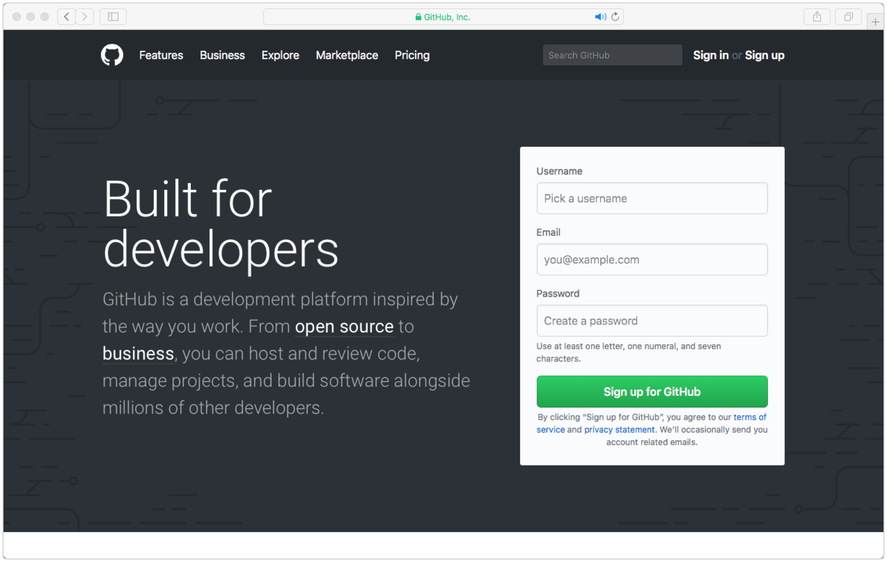
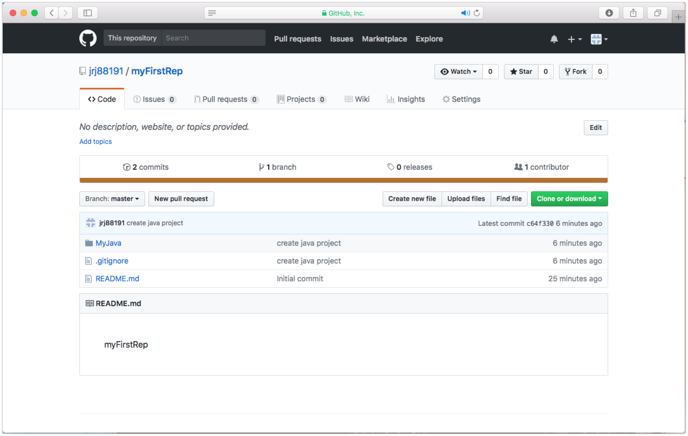

# Git 간편 사용설명서

작성자 : 정래진

최초 작성일 : 2018/04/28

##Git은 무엇인가?

**Git은 프로젝트를 빠르고 효과적으로 관리할 수 있도록 개발된 오픈소스 버전 관리 시스템이다.**

Git is a free and open source distributed version control system designed to handle everything from small to very large projects with speed and efficiency. - Git 공식홈페이지 (https://git-scm.com)

**Git을 활용하면...**

- 소스코드가 변경된 이력을 쉽게 확인가능
- 특정 시점에 저장된 버전과 비교하여 이전 버전으로 되돌아 갈 수 있음
- 내가 작성한 코드가 다른 사람이 편집한 내용과 충돌될 때, 알림하여 내용을 덮어버려 작성한 내용이 사라지는 상황을 회피

**저장소(Repository)**

저장소는 프로젝트에서 작성한 파일 폴더 등을 저장해 두는 곳으로, 원격 저장소와 로컬 저장소로 구분된다. 

저장된 파일은 변경 이력별로 구분되어 저장되는데, 이는 같은 이름의 파일도 수정된 내용에 따라 다른 버전으로 인식되어 변경사항별로 파일 및 폴더를 관리 가능하다.

- 원격저장소 (Remote Repository) : 온라인 상에 소스코드를 저장하고 관리하는 저장소로, 웹을 통해 여러사람에게 공유하거나, 개인에 한정하여 비공개로 활용할 수 있다. 
- 로컬저장소 (Local Repository) : PC에 작성한 소스코드가 저장된 폴더

##Git 사용 준비

### Git 설치

Git을 이용하기 위해서는, Git 웹사이트(https://git-scm.com)에서 설치 파일을 다운로드하여 설치한다.

**다운로드 후 설치 과정**

### 원격저장소

Git의 원격저장소를 제공하는 호스팅하는 대표적 서비스로 Github, Bitbucket 등이 있다.

Git은 기본적으로 무료로 운용되며, 비공개 원격저장소가 필요하다면 과금이 필요하다. 반면, Bitbucket은 기본적으로 비공개 원격저장소를 제공하지만, 저장소를 활용할 수 있는 인원이 5인으로 제한되며, 과금하면 제한 없이 활용할 수 있다.

원격저장소를 활용하기 위해서는 해당 원격저장소 호스팅 서비스에 가입해야한다.

**Github** (https://github.com)

**Bitbucket** (https://bitbucket.org)

**원격 저장소 생성 과정 (Github)**

- 회원가입 후 이메일을 확인하지 않은 경우

- Repository 명을 "myFirstRep"로 입력한 경우

### Git 클라이언트

Git은 콘솔(터미널) 환경에서 활용할 수 있지만, 편리하게 GUI 환경으로 동작할 수 있는 Git 클라이언트 프로그램이 있다.

대표적으로 SourceTree, GitKraken 등이 있다.

**SourceTree** (https://www.sourcetreeapp.com)

**GitKraken** (https://www.gitkraken.com)

**Git 클라이언트 실행 과정 (GitKraken)**

- Where to clone to : 로컬저장소 폴더 경로 (**소스코드들이 저장되는 워크스페이스를 (프로젝트 폴더) 선택**)
- URL : 원격저장소 주소 (https://github.com/jrj88191/myFirstRep.git)
- failed to get server certificate 에러 발생시 참조 : https://stackoverflow.com/questions/48985995/gitkraken-and-github-failed-to-get-server-certificate-the-handle-is-in-the-wr

- 설정완료 (Open Now 선택)

- 이클립스 워크스페이스 생성(로컬저장소 폴더 경로에 생성)

- 자바 프로젝트 생성

## Git의 활용

###커밋 (Commit)

코드를 작성한 후 원격저장소에 업로드할 내용을 설정하는 단계

- 자바 프로젝트를 수정한 후 화면

- "Stage all changes" 버튼을 누르면 원격저장소에 업로드할 수정된 소스코드 파일을 전체선택할 수 있음 (별도 선택하여 "Stage File" 버튼을 클릭)
- "Commit Message" 부분에 수정한 코드에 대한 설명을 작성
- "Stage files/changes to commit" 버튼을 클릭하여 Commit 동작을 수행

### 푸시 (Push)

변경된 소스코드를 Commit 단계를 통해 선택하고 이를 원격 저장소에 업로드하는 단계

- 원격저장소에 저장된 소스코드

### 풀 (Pull)

원격 저장소에 저장된 내용을 로컬 저장소로 업데이트하는 것

### 머지 (Merge)

- 향후 추가^^

### .gitignore

- 향후 추가^^

## References

누구나 쉽게 이해할 수 있는 Git 입문 (https://backlog.com/git-tutorial/kr/)

Git - 간편 안내서 (http://rogerdudler.github.io/git-guide/index.ko.html)

나무위키 - Git (https://namu.wiki/w/Git)